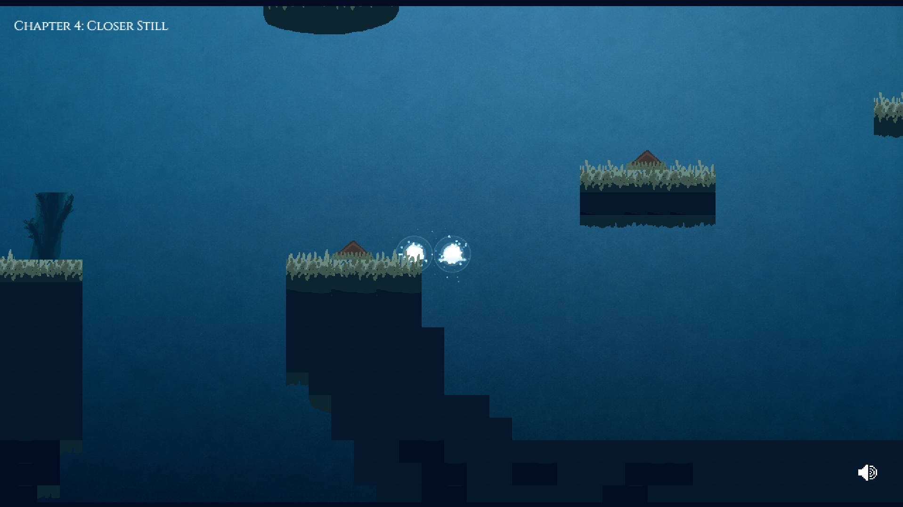
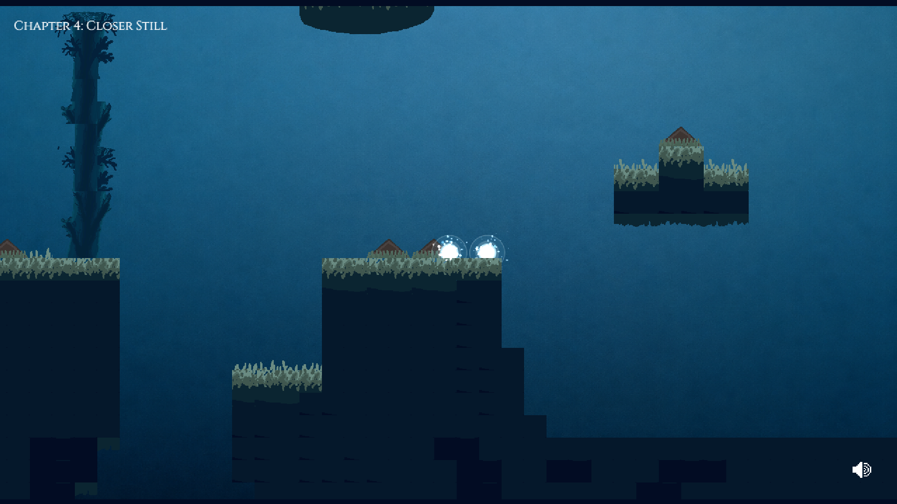

# Between Us

> *"Two lovers wake up in the same world but not the same reality.*
>
> *What's solid on your screen might not be solid for them. What
> blocks their path might be invisible to yours. The only way through
> is to talk, to trust what the other person tells you, even when you
> can't see it yourself.*
>
> *Between Us is a short platformer for two players about two minds
> trying to stay close. Six chapters, one love story, with something
> stranger folding underneath.*
>
> *You'll need a friend for this one. Neither of you can finish it
> alone."*

Created for KiwiJam 2026.

[](https://leocaoprojects.itch.io/between-us)

## About

Between Us is a platform game for two people. You and your partner
play through the same six chapters, but you each see a different
version of the world.

The platforms you stand on appear on your partner's screen instead
of yours, so you have to talk and guide each other.

<p align="center"><em>Player 1's world on the left. Player 2's world on the right.</em></p>

<p align="center">
  
  
</p>

## Controls

- Move with `A` and `D`, or the left and right arrow keys
- Jump with `W` or the up arrow key
- Ping a location for your partner with left click
- Place a temporary block with right click, or hover and press `E`
- Reset both players with `R`

## Built with

- React
- Phaser
- Colyseus
- Node.js
- Vite
- Tiled

## Running locally

Node.js 18 or newer is required.

Install and start the server:

```bash
cd server
npm install
npm start
```

In a second terminal, install and start the client:

```bash
cd client
npm install
npm run dev
```

Open `http://localhost:5173` in two browser windows. Create a lobby in
one window, then join it from the other using the lobby code.

## Credits

- Dan Martin: Music and sound effects
- [Leo Cao](https://github.com/LeoCaoProjects): Developer
- [Fateh Bhular](https://github.com/fatehbhular): Designer
- [Shawn Lee](https://github.com/ShawnLeeyz): Developer
- Shyam Sharma: Narration and animation
- [Wei-Xiang Yong](https://github.com/LongNightOfSolace2552): Developer and designer
